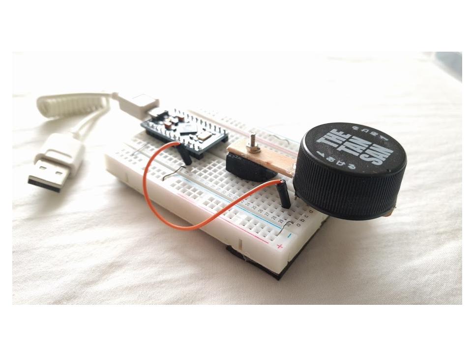

# OneKey
I would like to show you a new concept keyboard.  
That is use CW code. So only one key but express alphabetic and numeric.　　  
You can use it as a USB HID class by using Arduino Leopardo.
The handle lever is a stick of ice candy.
The knob is a plastic bottle cap.
And the fulcrum of the handle lever is the eraser.
Anyone can create it right away, And enjoy the new concept keyboard.

# CW Code
see follows  
https://en.wikipedia.org/wiki/Morse_code#/media/File:International_Morse_Code.svg

# Schematics
TO BE DONE

# Video
TO BE DONE
